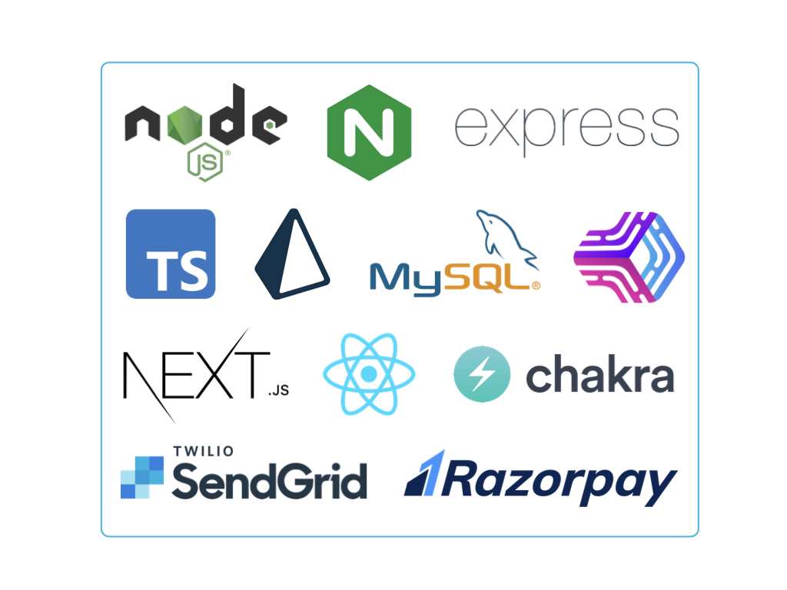

# Ecstacy

<span style="color:purple">**Ecstacy**</span> is a secure, e-commerce website developed primarily to facilitate buying and selling of products between users.

## Description
### :busts_in_silhouette: Users
* **Buyers -** Buyers are the free users of this service. Buyers can log into or sign up for the website and get access to all the products featured on the website. Buyers search products and can purchase these products.

* **Sellers -** Any user can become a seller by uploading a proposal pdf document and send it to the admin via the website. Once the user is approved to be a seller, they can set their inventory and sell products.

* **Admins -** Admins approve sellers after reviewing their proposal. They can also ban suspicious sellers, buyers and products. Admins can also view the transaction/audit logs for the website.

### :sparkles: Features
* Selling, sharing and purchasing products
* Searching products by name, category and description.
* Creation and maintenance of product catalog
* A working payment gateway
* Editable user profile
* Feature to reset account password 
* Individual product pages with an image carousel featuring two or three images per product
* Working document and image upload functionality
* Images and pdfs are served statically
* A well described privacy policy
* Multiple users can use the website simultaneously
* Clean, intuitive and minimalistic UI

### :lock: Security
* A self-signed SSL certificate
* Multi-factor authentication while signing up using emailed OTP tokens.
* OTP verification while deleting one's own account
* Virtual keyboard for entering OTPs
* Well-implemented session management
* Anti-csrf tokens
* Audit logs
* Secure HTTP headers like HSTS
* Input validation and sanitization
* IP-address based rate limiting
* Appropriate environment variables
* No outdated libraries or components
* Prisma ORM used instead of raw MySQL queries in the backend
* Proper access control
* Unnecessary sensitive data like credit card information is not stored. 
* All sensitive data communication from server to client done through POST requests only.
* Strong password enforcement, hashing and salting passwords with a strong hash function before storing them in the database
* PM2 production process manager to ensure that the application stays alive, reloads without downtime and auto restarts after crashes

## Technologies Used

## Getting Started
To run <span style="color:purple">**Ecstacy**</span> locally, do the following:

Clone this repo and the [server api](https://github.com/ecstacy-fcs/api) repo

```zsh
git clone https://github.com/ecstacy-fcs/client.git
git clone https://github.com/ecstacy-fcs/api.git
```

Go to the project directory and install dependencies
```zsh
cd api
npm install
#and
cd client
npm install
```

You will need to add the following environment variables to your .env.local file

`NEXT_PUBLIC_API_BASE_URL`

Make sure to add the environment variables for the server too. Refer to .[env.local.example](.env.local.example) and [api/.env.example](https://github.com/ecstacy-fcs/api/blob/main/.env.example) for example environment variables.

Run the development server for both client and api:
```zsh
#use this command for both server and client
npm run dev
```
The client runs on port 3000 and the api runs on port 5000.

Open [http://localhost:3000](http://localhost:3000) with your browser to see the result.

## Authors
This project was developed by **MDMA**
* [Meetakshi Setiya](https://www.github.com/meetakshi253)
* [Dev Rajput](https://www.github.com/thesantatitan)
* [Mihir Chaturvedi](https://www.github.com/plibither8)
* [Ananya Lohani](https://www.github.com/ananyalohani)
## License
[MIT](https://choosealicense.com/licenses/mit/)
